# Advanced Census EDA Report

## Overview
Analysis of 16 specific questions regarding school quality, infrastructure, and outcomes.

### 1. Constituency Quality Comparison

Top 20 constituencies with the highest overall school quality index.

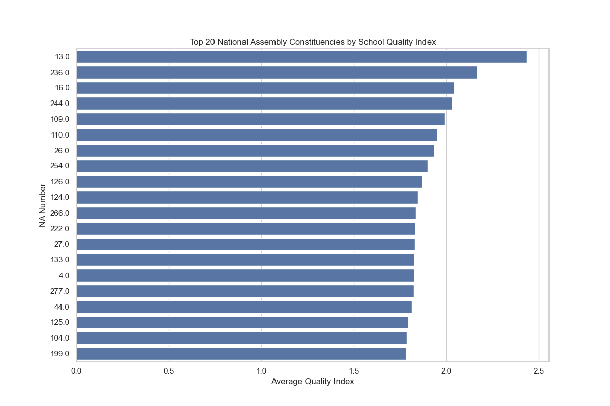

### 2. Predictors of Functionality

Factors most strongly predicting whether a school is Functional.

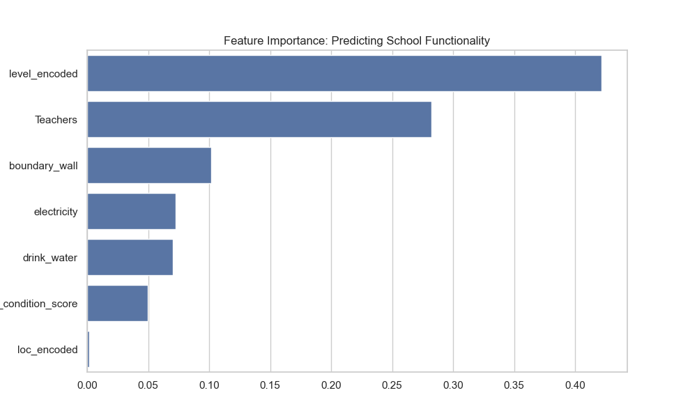

### 3. Under-resourced Districts

Districts with the lowest facilities per student ratio.

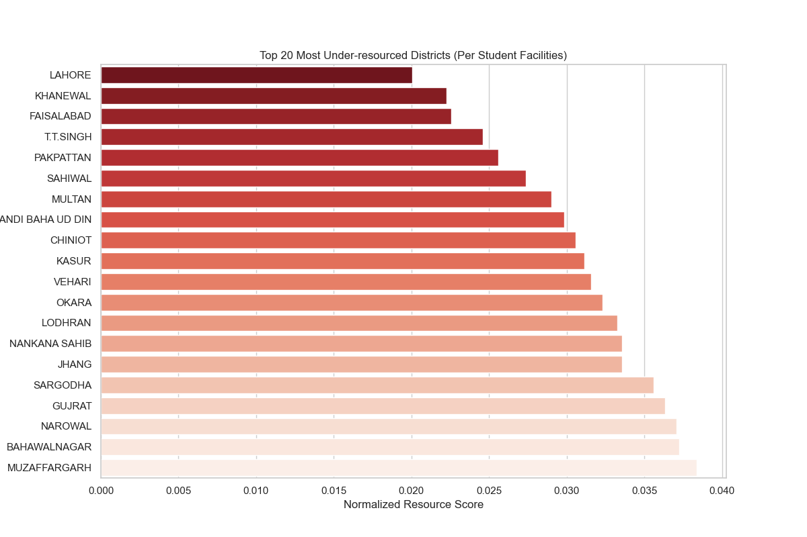

### 4. Infrastructure vs Gender (Rural)

Comparison of key facilities in rural Male vs Female schools.

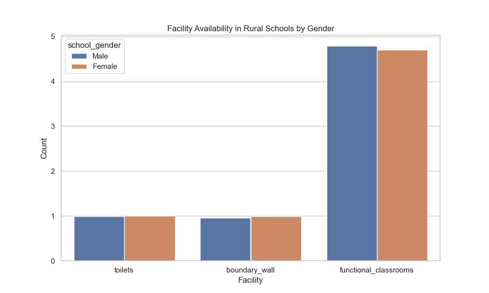

### 5. Upgraded Schools Strain

Comparison of dangerous classroom counts in upgraded vs non-upgraded schools.

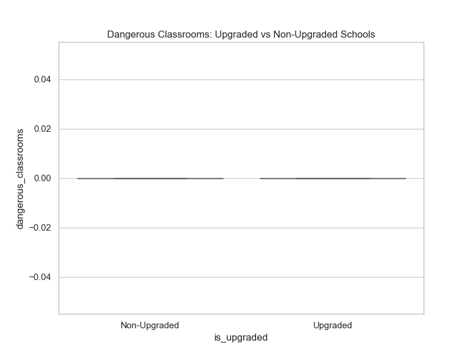

### 6. Lab Predictors

Correlation between lab availability and school size/infrastructure metrics.

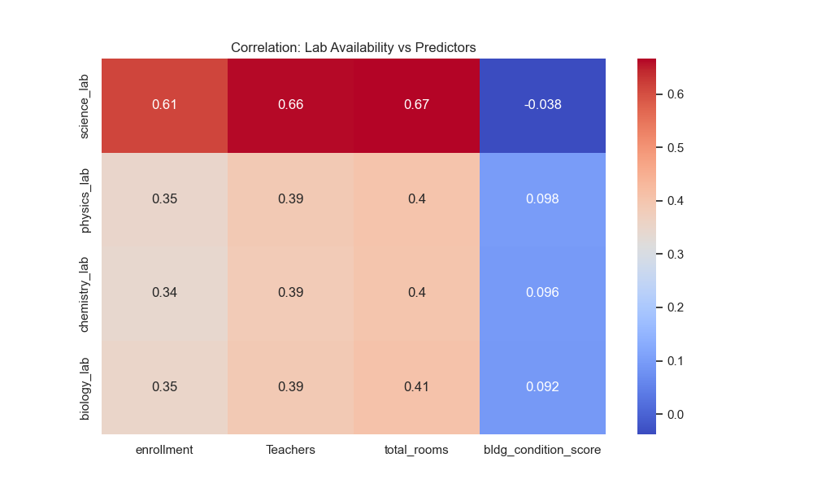

### 7. Teacher Furniture Impact

Relationship between teachers having furniture and student enrollment.

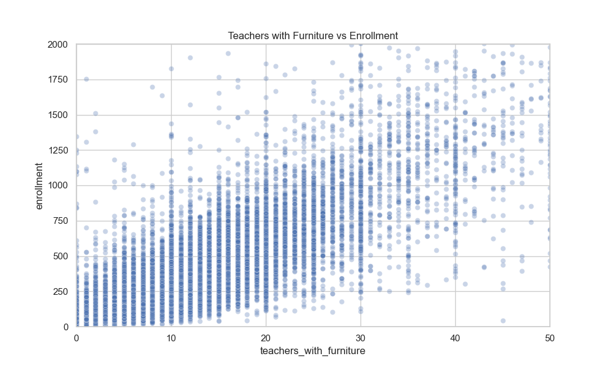

### 8. Security & Female Enrollment

Impact of boundary walls on enrollment in female schools.

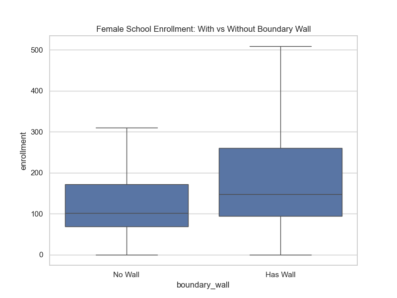

### 9. Facilities vs Teacher Retention

Association between facility quality and head teacher status (Permanent vs Temporary).

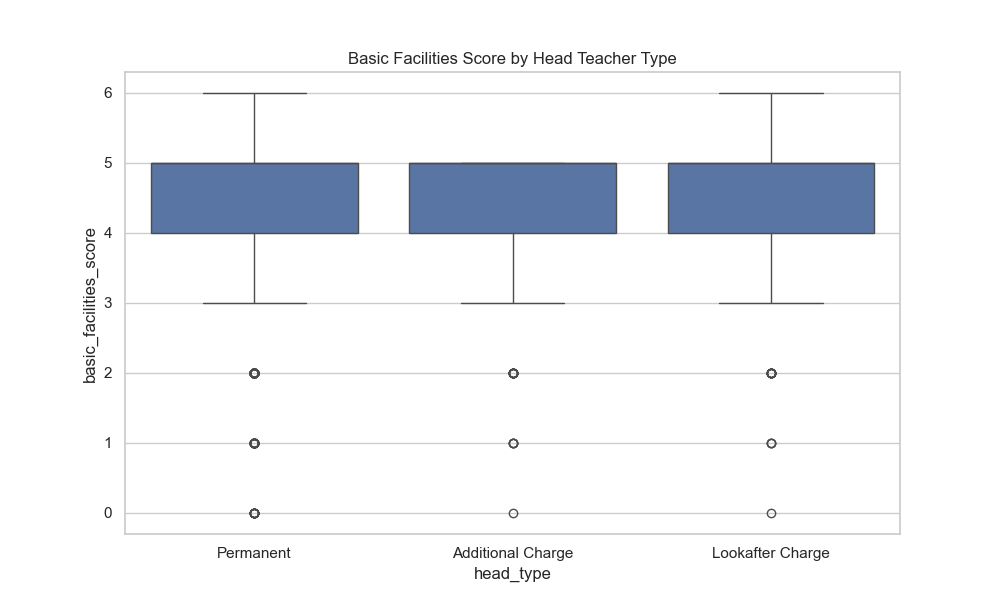

### 10. Spatial Disparities

Tehsils with the highest percentage of dangerous classrooms.

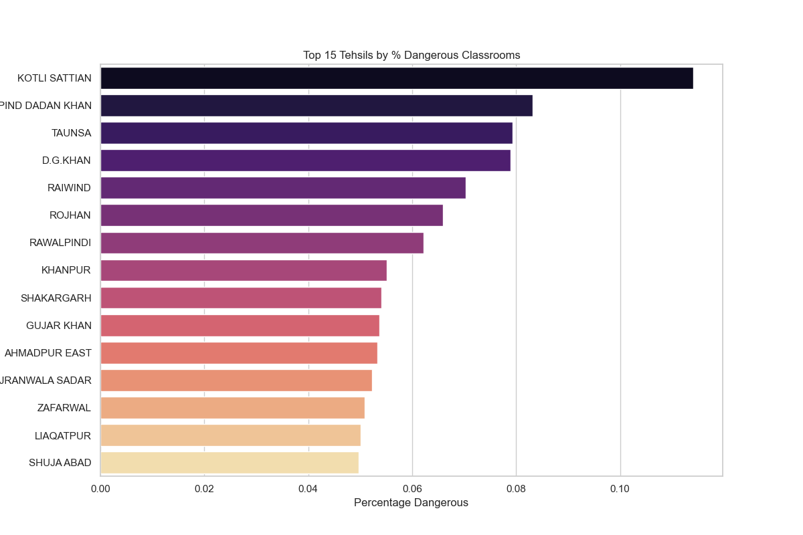

### 11. Land vs Functionality

Relationship between available land area and actual functional classrooms.

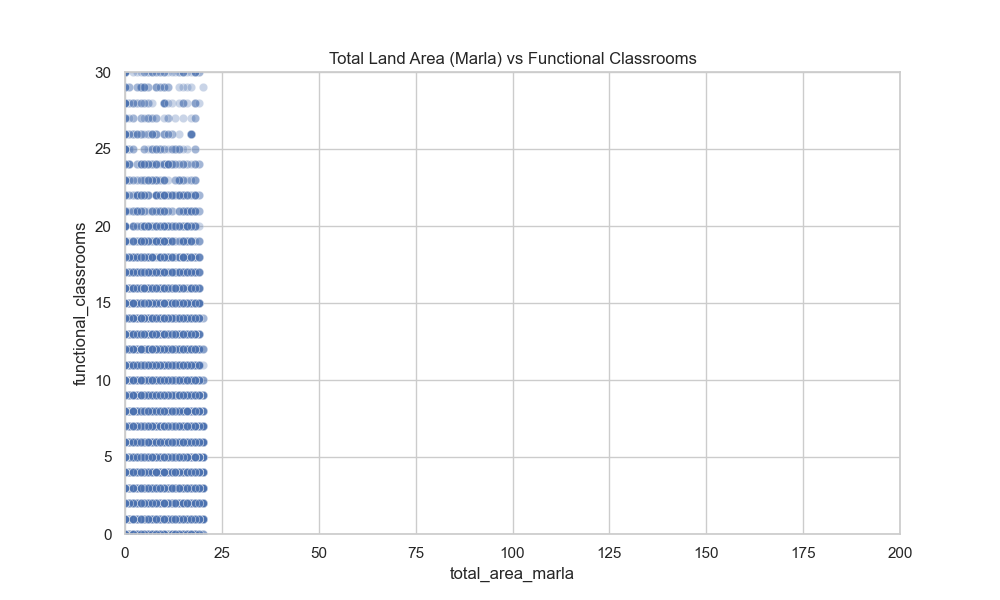

### 12. Playground Impact

Enrollment differences in Middle/High schools based on playground availability.

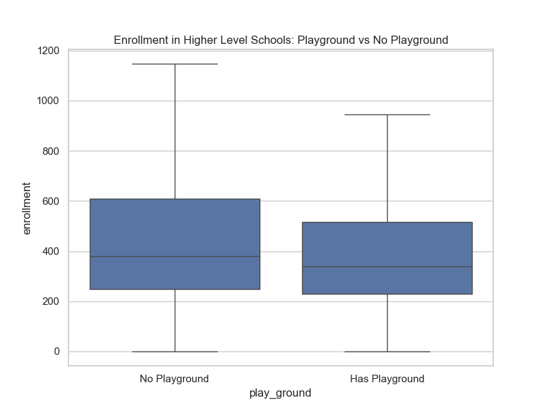

### 13. School Clustering

Clustering of schools based on infrastructure, enrollment, and teachers.

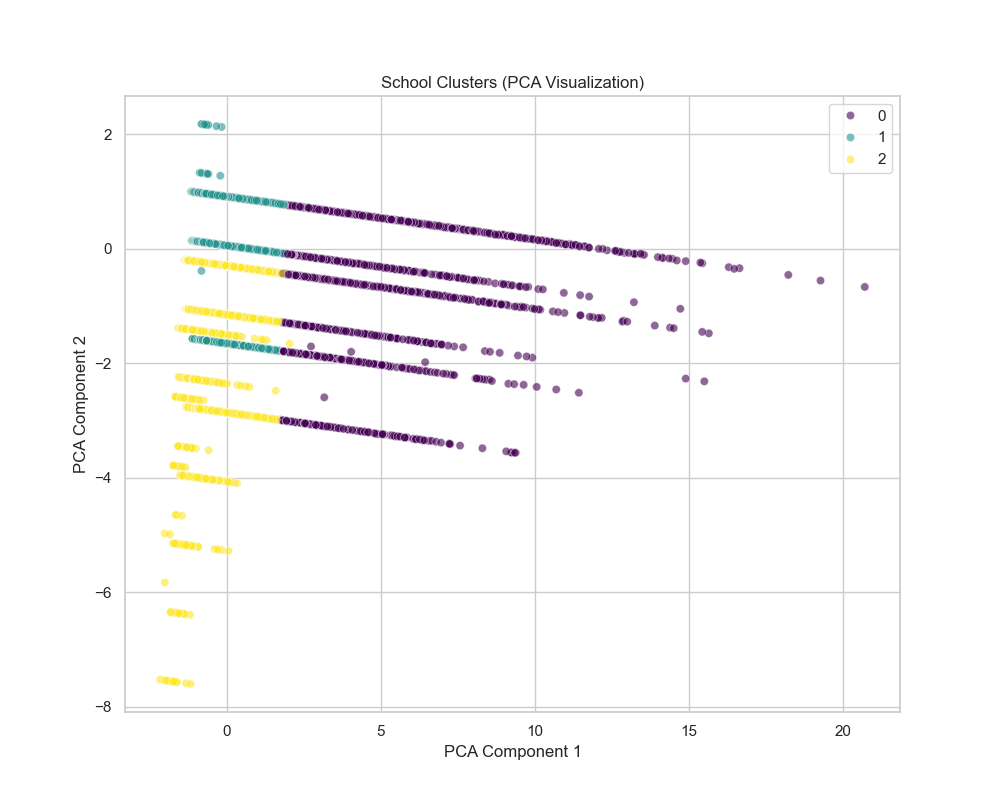

### 14. Internet Access Predictors

Internet availability breakdown by school level and urban/rural location.

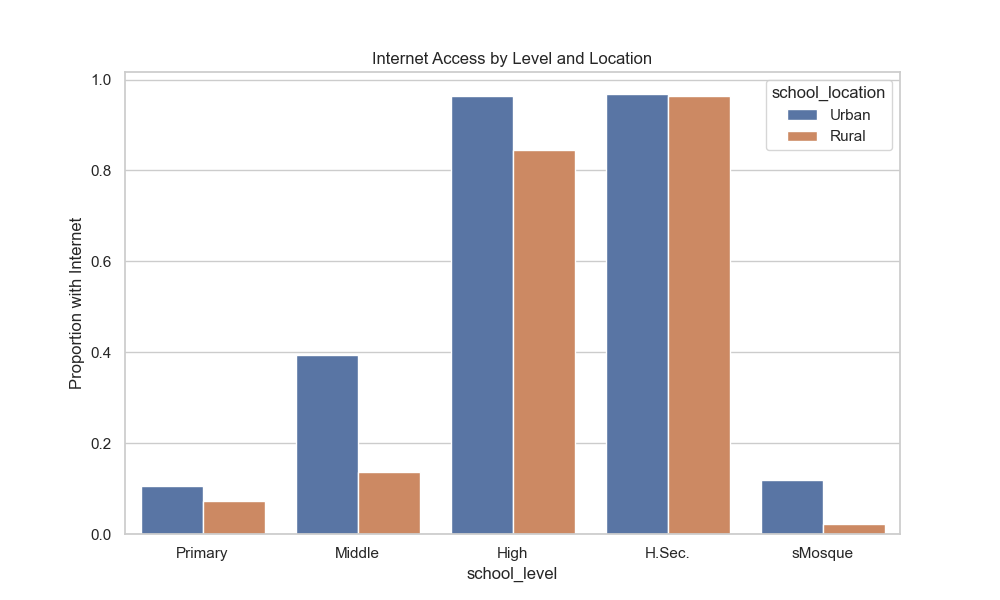

### 15. STR vs Facilities

Relationship between facility completeness and student-teacher ratio.

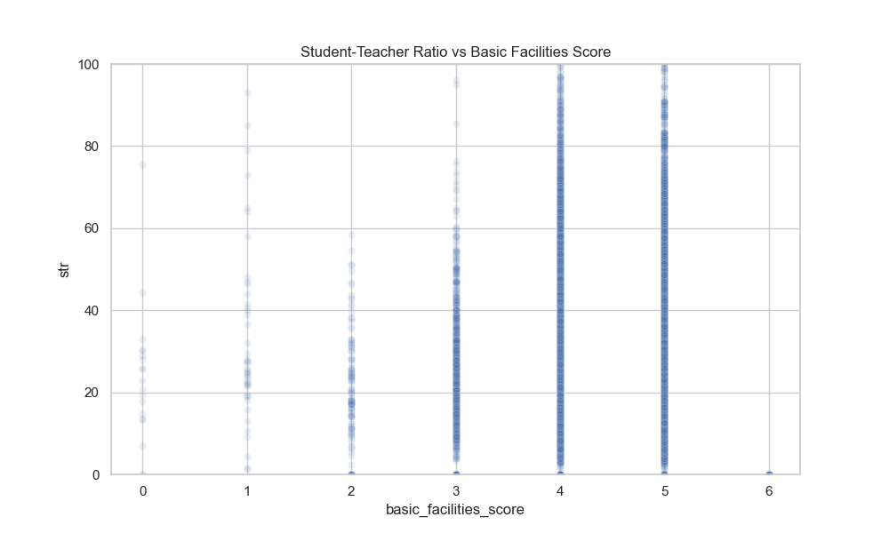

### 16. Age vs Infrastructure

Comparison of building condition scores between schools established before and after 1980.

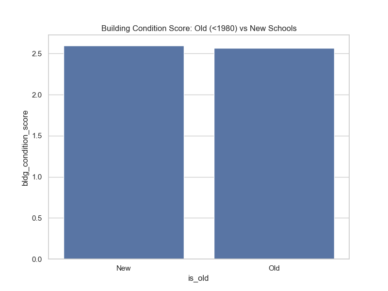

