# Census Data EDA Report

## Dataset Overview
This report provides a comprehensive analysis of the October 2018 Public Census data, focusing on school infrastructure, enrollment, and facilities.

### School Level Distribution

Count of schools across different levels (Primary, Middle, High, etc.).

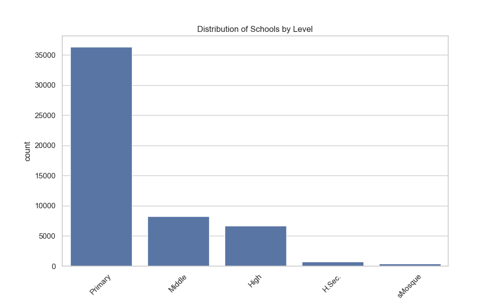

### Urban vs Rural Enrollment

Comparison of total student enrollment in Urban vs Rural areas.

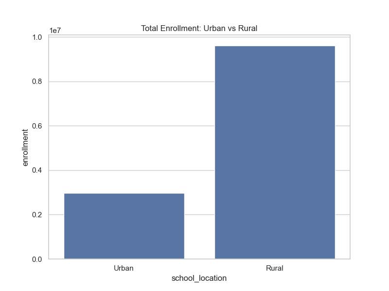

### School Gender Distribution

Breakdown of schools designated for Male, Female, or Both.

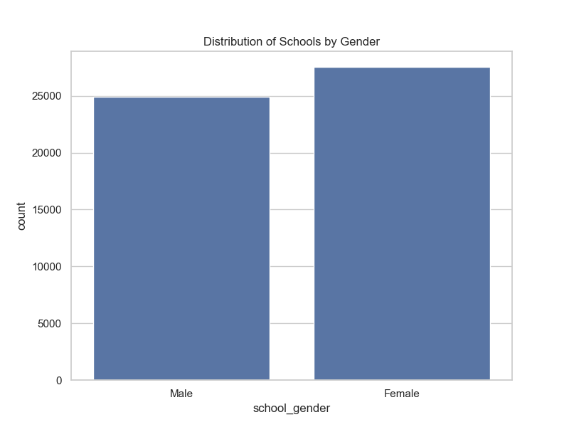

### Building Condition

Proportion of schools with varying building conditions.

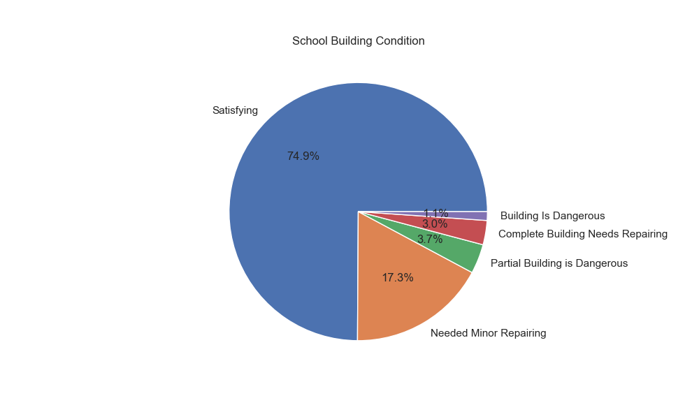

### Basic Facilities Access

Percentage of schools possessing key facilities like Electricity, Water, Toilets, and Boundary Walls.

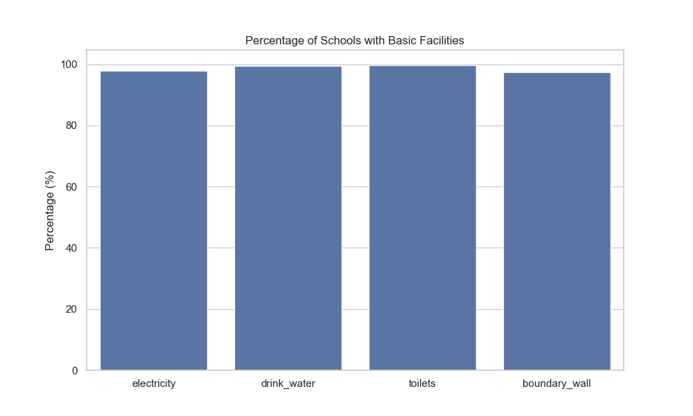

### Student-Teacher Ratio by District

Districts with the highest average Student-Teacher Ratios, indicating potential teacher shortages.

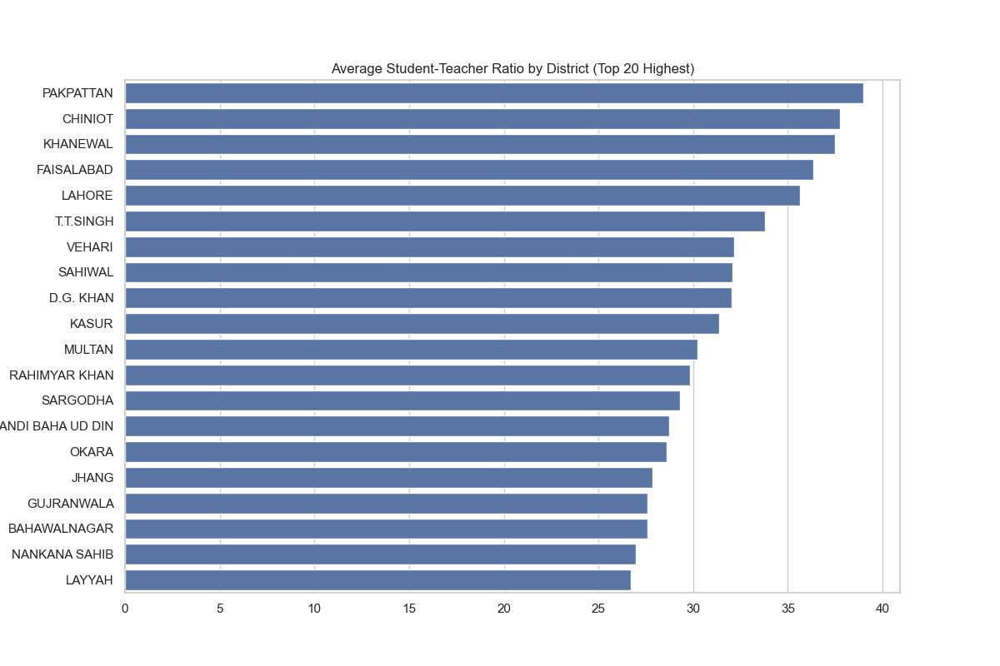

### Classroom Availability

Histogram showing the distribution of functional classrooms available in schools.

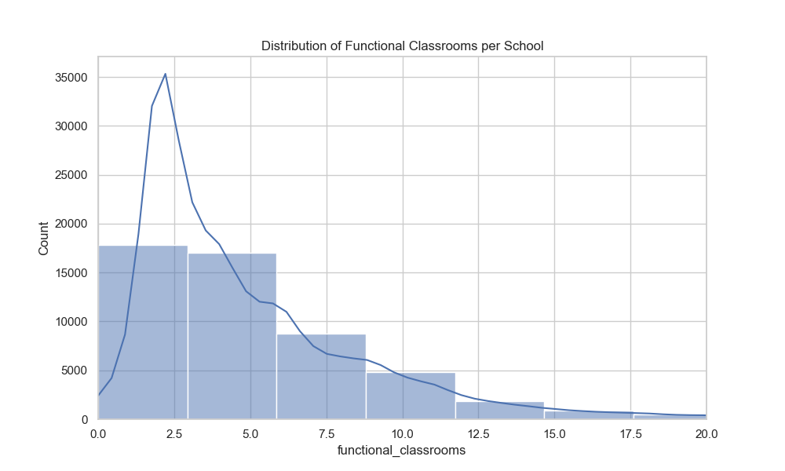

### Computer Lab Availability

Proportion of schools with computer labs across different education levels.

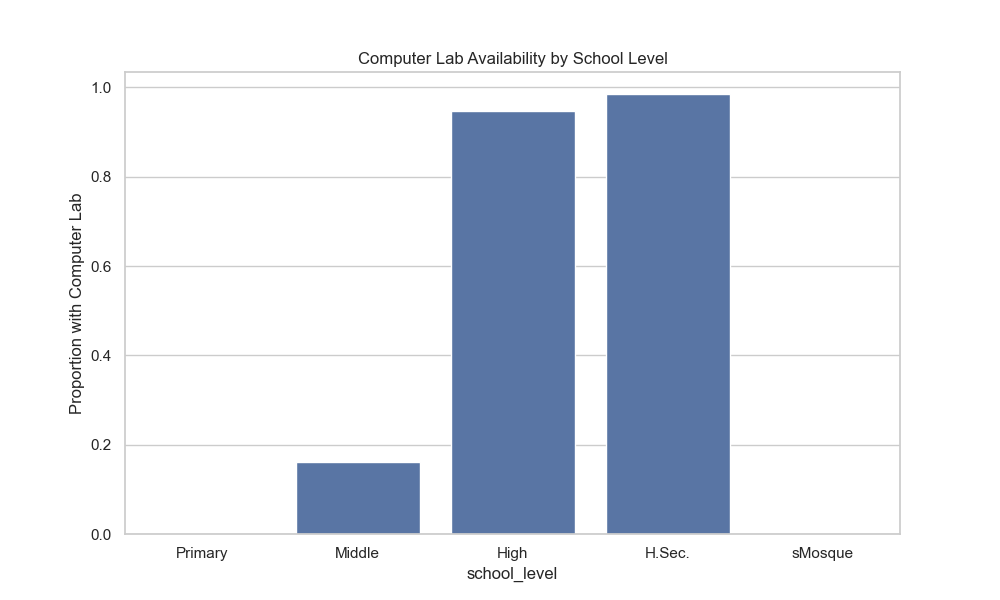

### Library Availability

Proportion of schools with libraries across different education levels.

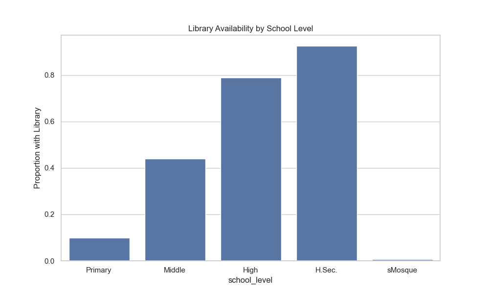

### Enrollment vs Teachers

Scatter plot showing the relationship between student enrollment and teacher count.

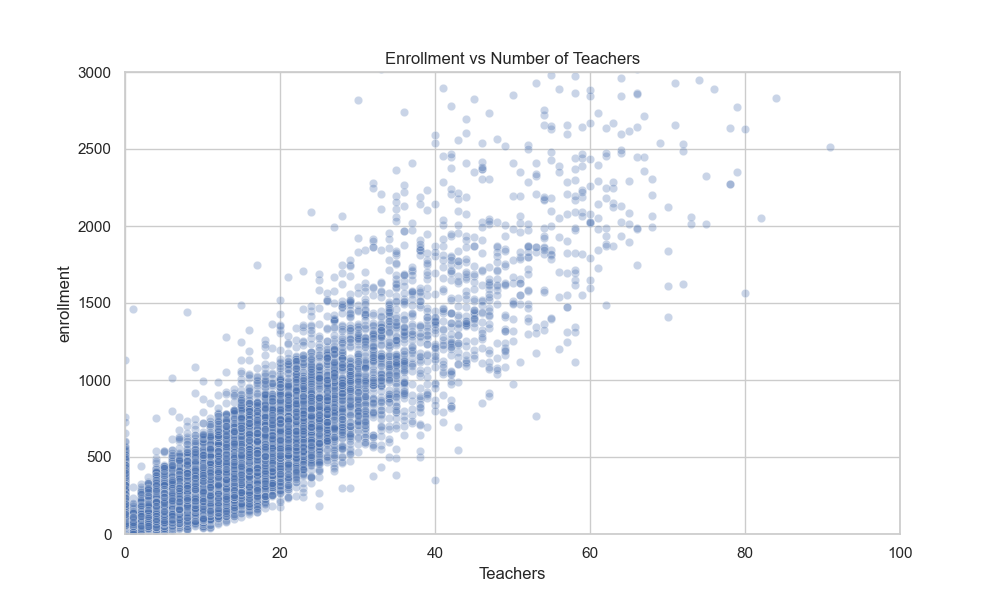

### Electricity Source

Breakdown of electricity sources (e.g., WAPDA, Solar) used by schools.

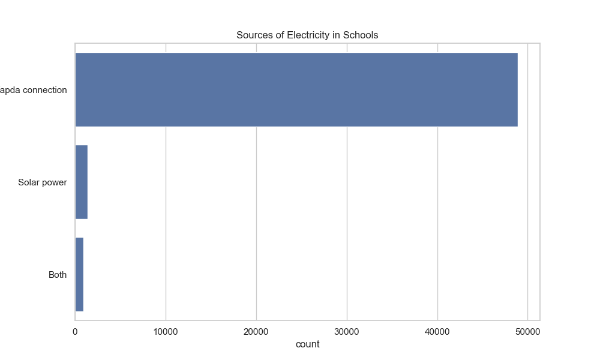

### Drinking Water Source

Common sources of drinking water in schools.

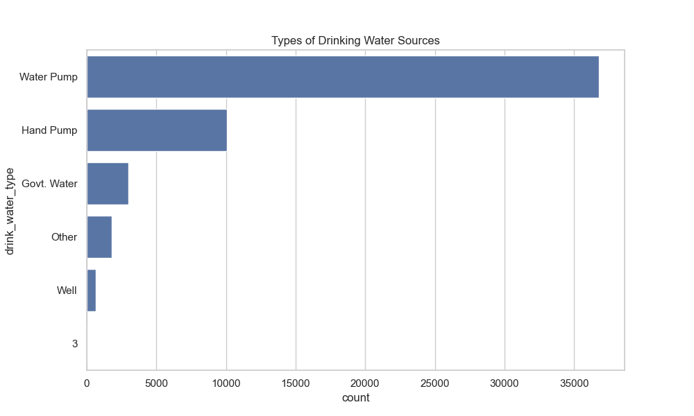

### Playground Availability

Comparison of playground availability in Urban vs Rural schools.

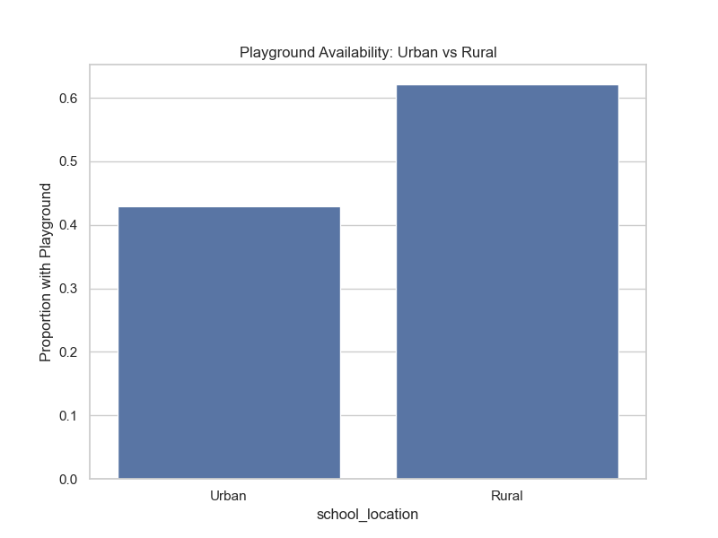

### School Status

Count of functional vs non-functional schools.

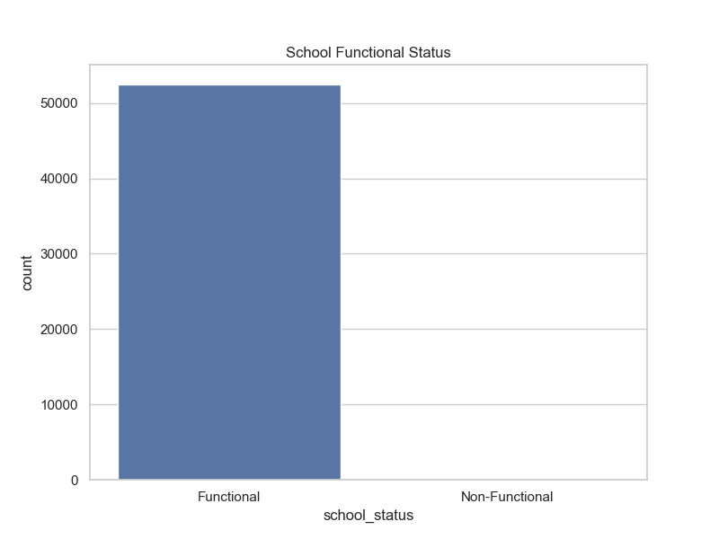

### Establishment Year Trend

Timeline showing when schools were established, highlighting periods of rapid expansion.

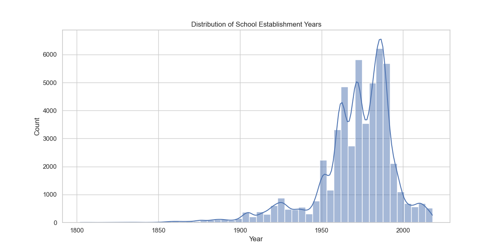

