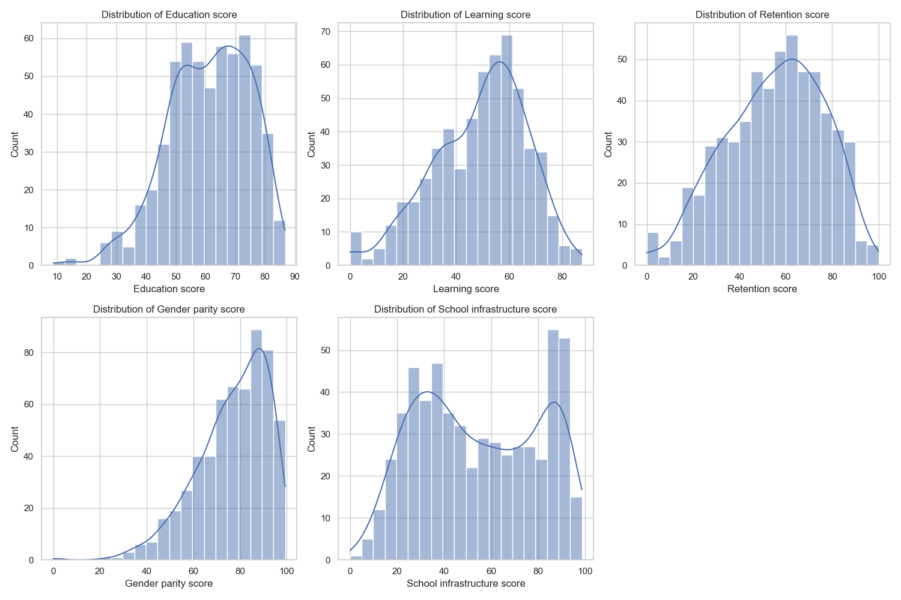
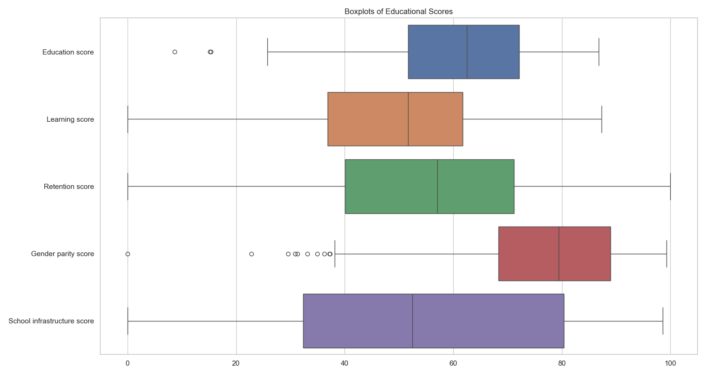
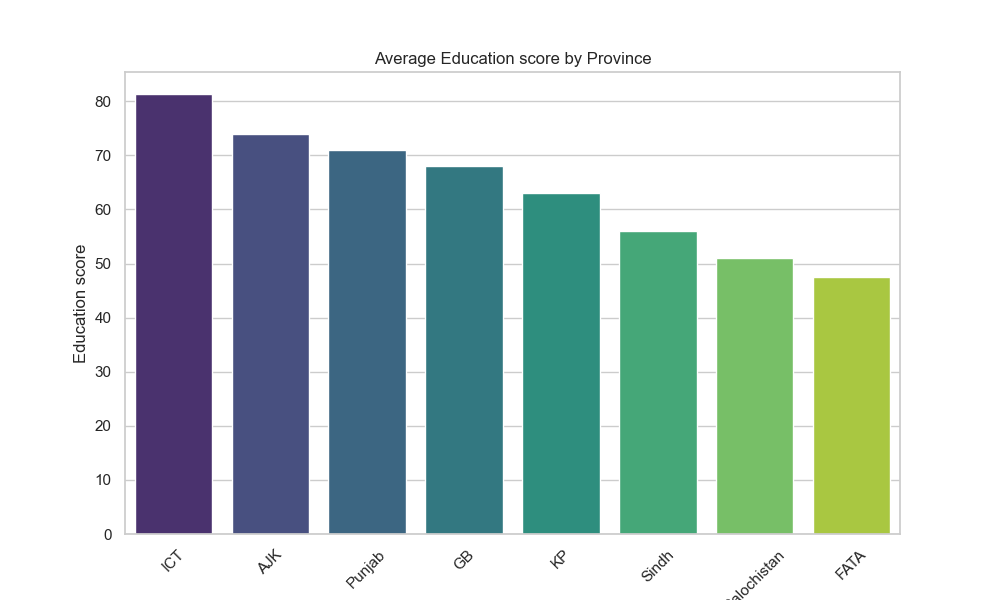
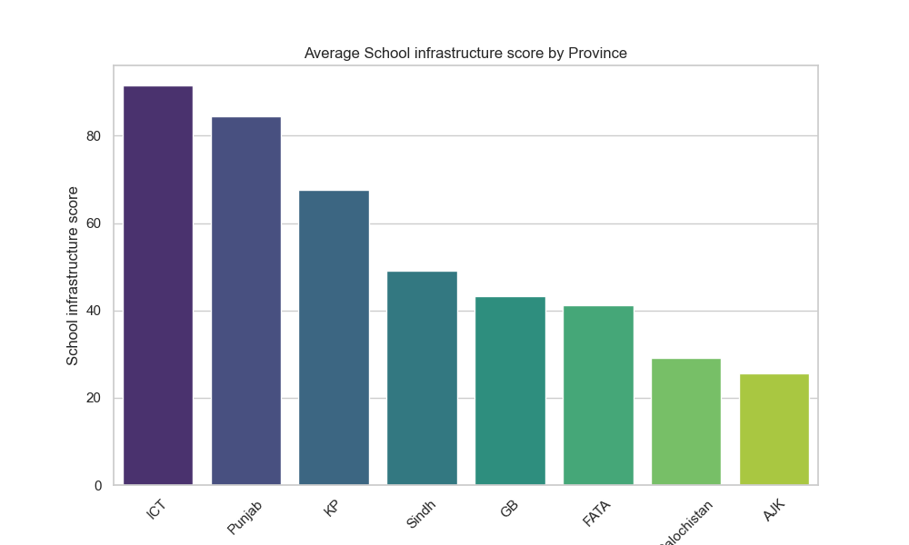
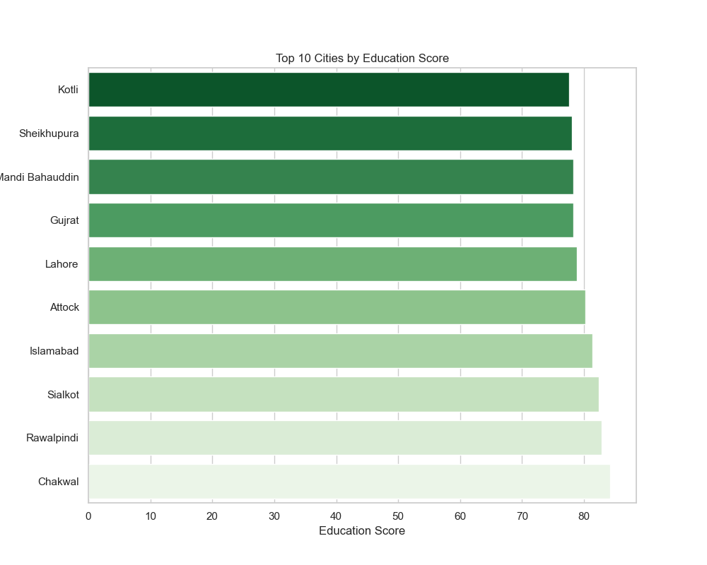
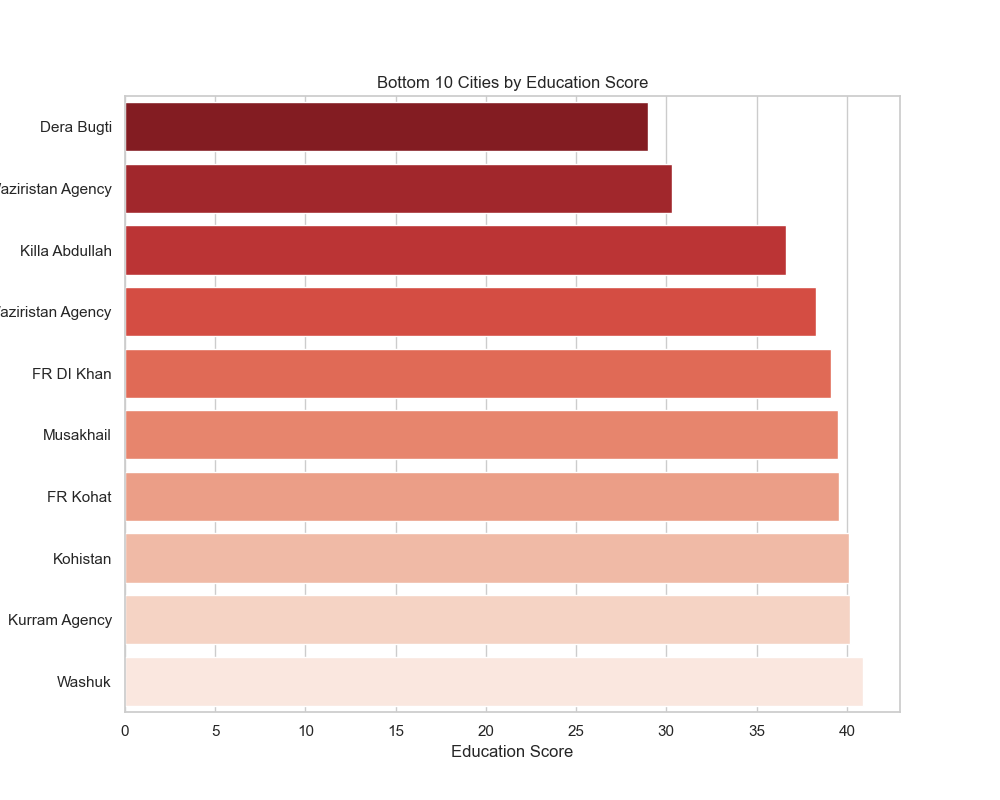
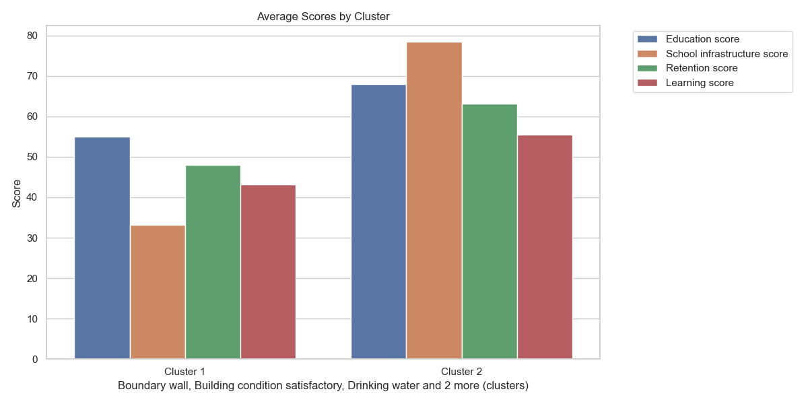
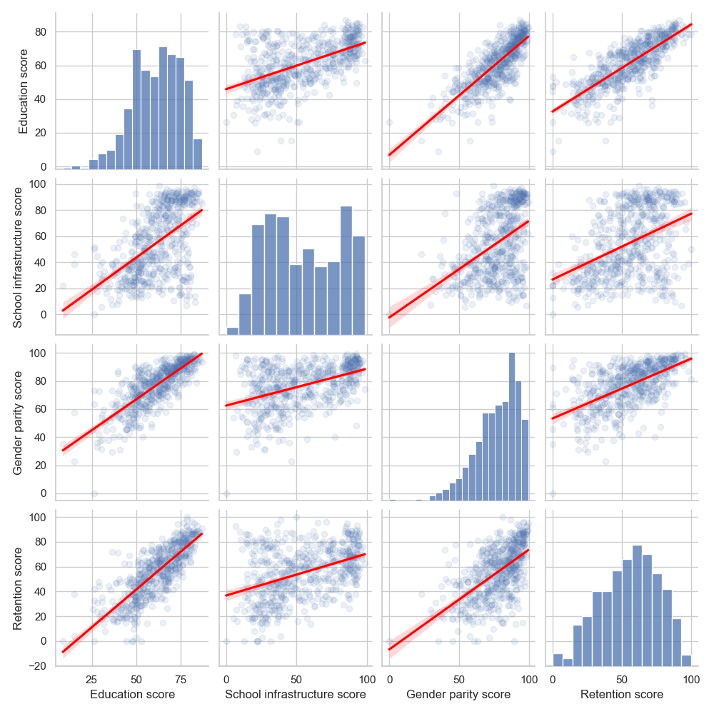
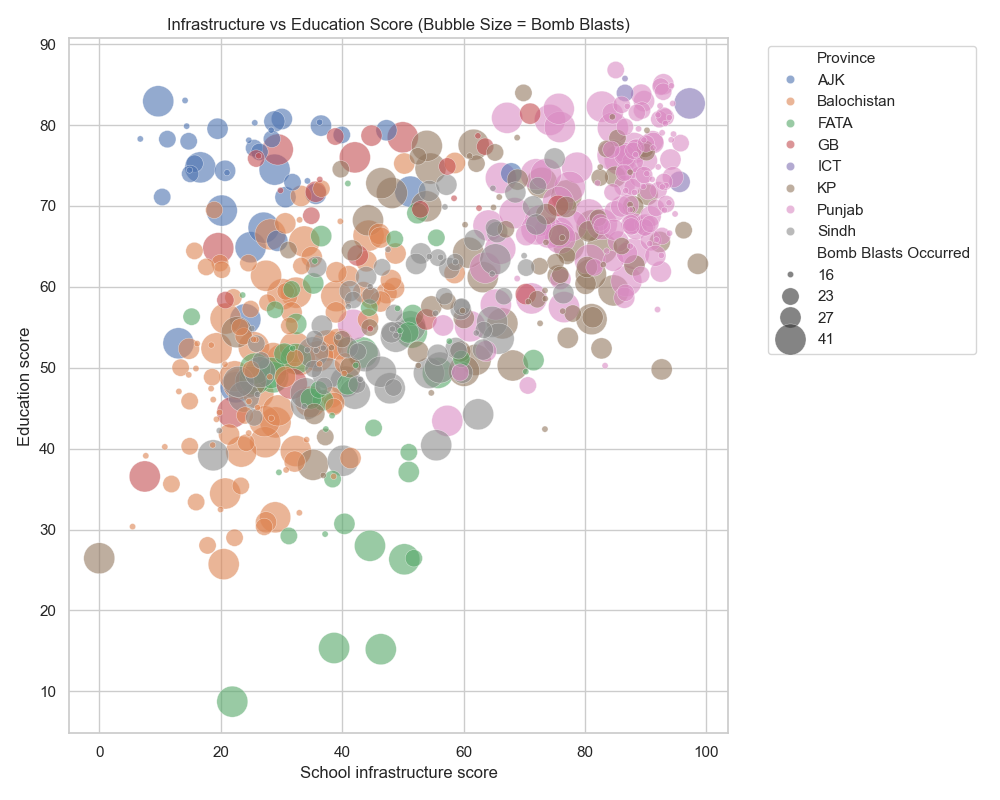
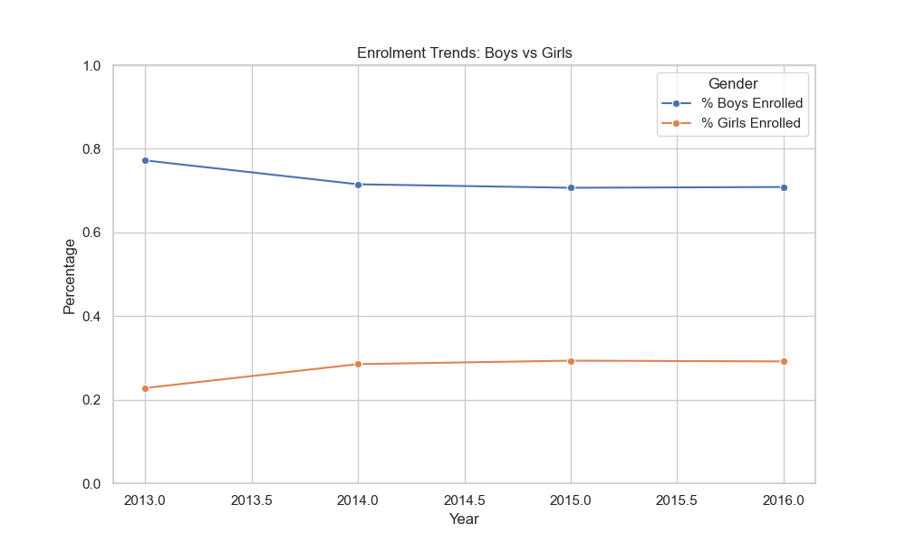

# Expanded Automated EDA Report

## Dataset Overview
This report contains a deep dive into the educational dataset, covering distributions, geographic trends, cluster profiles, and multivariate interactions.

### Score Distributions

Analysis of score distributions. Histograms show the spread and skewness, while boxplots highlight outliers and central tendencies.

### Geographic: Education score by Province

Comparison of Education score across different provinces. Helps identify high and low performing regions.

### Geographic: School infrastructure score by Province

Comparison of School infrastructure score across different provinces. Helps identify high and low performing regions.

### City Performance Extremes

Identification of the best and worst performing cities based on Education Score.

### Cluster Profiling

Profile of different clusters based on key educational metrics. Shows distinct characteristics of each group.

### Multivariate Relationships

Pairwise relationships between key metrics. The regression lines indicate the direction and strength of trends.

### Security Impact Bubble Plot

Multidimensional view: Infrastructure vs Education Score, with bubble size representing security incidents. Large bubbles in low-score areas suggest security impact.

### Enrolment Trends

Line chart showing the progression of enrolment percentages over time.

